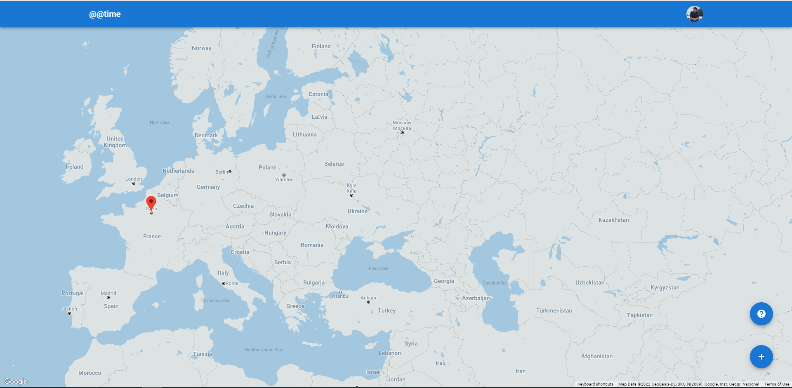
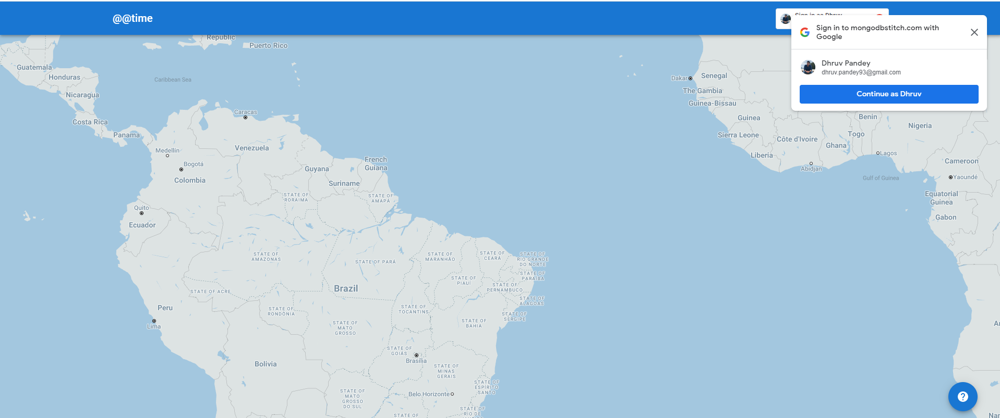
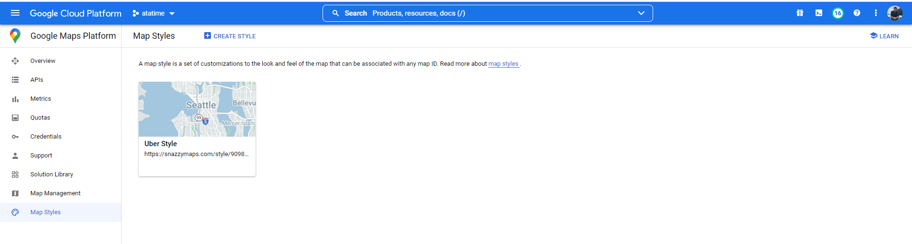

# @@time(at a time)

## Idea
On a Wednesday night traveling by cab, I felt how many people would be doing the same activity as me at the same time. That's when I started implementing @@time(at a time). 

@@time is a simple application that lets users mark their current activity and then check the list of
other users doing the same activity at that time around the world.

> Check the final working version [here](https://atatime-wmqjt.mongodbstitch.com/)
> Check the react-native version [here](https://github.com/pdhruv93/atatime-react-native-final)

## Tech Stack used
- **Frontend:** React(18.1.0) and TypeScipt, [React MUI(Material UI)](https://mui.com/)
- **Backend:** MongoDB Atlas DB and MongoDB Atlas App Services(Serverless functions, Triggers)
- **Other:** Google OAuth2, Google Maps, Formik+Yup

## Sample Screenshots
### Home Screen

### One Tap Google Login

### Modal showing App instructions

### Activities list coming from MongoDB

### User Profile Modal and update sections

### Modal showing other users who are doing same activity whenever user marks any activity alongwith their markers on the map

### Google Cloud Platform used for Google Maps and OAuth2

### MongoDB Atlas screenshot showing serverless functions. There is a lot happening as serverless architecture

## Dev related Info
### Create react app
npx create-react-app my-app --template typescript

### Linting and Prettier
https://blog.devgenius.io/eslint-prettier-typescript-and-react-in-2022-e5021ebca2b1

### Old Dependency issues
npm install modulename --legacy-peer-deps